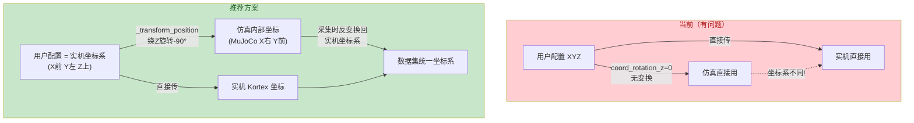
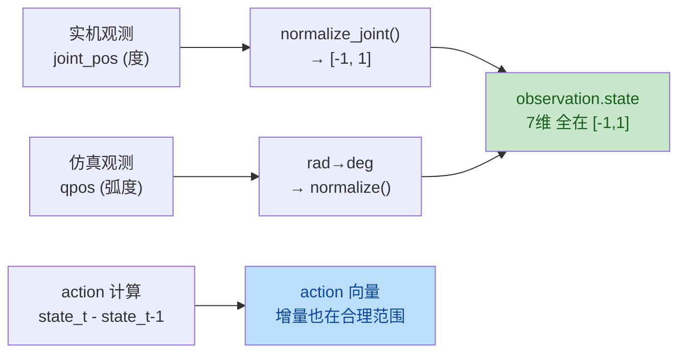

# VLA 训练数据设计分析与建议

以下是针对 VLA 训练的数据设计建议：

---

## 一、坐标系统一方案

### 核心原则：以实机为基准，仿真向实机对齐



### 具体设置

```yaml
# real_config.yaml
simulation:
  coord_rotation_z: -90   # 用户坐标(实机) → MuJoCo坐标 的旋转角
```

变换效果：

| | 用户/实机坐标系 | MuJoCo 内部 |
|--|---------------|-------------|
| X | **前方** | 右方 |
| Y | **左方** | 前方 |
| Z | 上方 | 上方 |

**关键：采集数据时必须反变换回来**，保证数据集中的 XYZ 含义一致。

---

## 二、关节角度数据处理方案

### 当前问题分析

| 问题 | 现状 | 影响 |
|------|------|------|
| 范围定义错误 | 代码写 `[0°, 360°]` | 实际有负值（如 `-164.9°`）|
| 正负混杂 | 同一关节可正可负 | 网络难以学习边界 |
| 未归一化 | 直接存原始度数 | 不同关节量级差异大 |
| 实机 vs 仿真 | 单位不同（度 vs 弧度） | 数据分布不一致 |

### 推荐方案：归一化到 [-1, 1]

这是 ACT / OpenPI 等主流 VLA 方法的标准做法。

#### 方案对比

| 方案 | state 表示 | action 表示 | 优点 | 缺点 |
|------|-----------|------------|------|------|
| **A: 归一化角度 [-1,1]** | `(angle - mid) / half_range` | 归一化增量 | 训练稳定、泛化好 | 需要知道每个关节范围 |
| B: 原始度数 | 直接度数 | 度数增量 | 直观可读 | 数值跨度大、难收敛 |
| C: 弧度 | 直接弧度 | 弧度增量 | 物理意义明确 | 数值太小 |

**推荐方案 A**，原因：
1. ACT 论文原始实现就是归一化的
2. OpenPI 也要求归一化输入
3. 所有维度在同一量级，网络更容易学习

#### 具体实现

**Gen3Lite 各关节实际范围**（需要从机械臂规格确认，以下为典型值）：

```python
# gen3_lite.py 中应修正为实际范围
JOINT_LIMITS = {
    "joint_1": {"min": -128.0, "max":  128.0},  # 基座旋转
    "joint_2": {"min": -147.5, "max":  147.5},  # 肩部
    "joint_3": { "min": -150.0, "max":  150.0},  # 肘部
    "joint_4": { "min": -145.5, "max":  145.5},  # 腕部俯仰
    "joint_5": { "min": -270.0, "max":  270.0},  # 腕部旋转
    "joint_6": { "min": -120.0, "max":  120.0},  # 法兰旋转
}
```

**归一化公式**：

```python
def normalize_joint(angle_deg: float, joint_limits: dict) -> float:
    """将关节角度归一化到 [-1, 1]"""
    mid = (limits["max"] + limits["min"]) / 2
    half_range = (limits["max"] - limits["min"]) / 2
    return np.clip((angle_deg - mid) / half_range, -1.0, 1.0)

def denormalize_joint(normalized: float, joint_limits: dict) -> float:
    """从 [-1, 1] 反算回角度"""
    mid = (limits["max"] + limits["min"]) / 2
    half_range = (limits["max"] - limits["min"]) / 2
    return normalized * half_range + mid
```

**数据采集时的处理流程**：



---

## 三、完整推荐的数据格式

### observation.state（7维，全部归一化）

| 索引 | 名称 | 范围 | 来源 |
|------|------|------|------|
| 0 | j1_norm | [-1, 1] | 关节1归一化角度 |
| 1 | j2_norm | [-1, 1] | 关节2归一化角度 |
| 2 | j3_norm | [-1, 1] | 关节3归一化角度 |
| 3 | j4_norm | [-1, 1] | 关节4归一化角度 |
| 4 | j5_norm | [-1, 1] | 关节5归一化角度 |
| 5 | j6_norm | [-1, 1] | 关节6归一化角度 |
| 6 | gripper | [0, 1] | 夹爪位置（已天然归一化）|

### action（7维，归一化增量）

| 索引 | 名称 | 含义 |
|------|------|------|
| 0-5 | dj_norm | 各关节的归一化角度**增量** |
| 6 | dgripper | 夹爪位置增量 |

### cartesian pose（可选附加信息）

如果需要在 state 中加入末端位姿（部分 VLA 方法需要）：

| 索引 | 名称 | 范围 | 说明 |
|------|------|------|------|
| ee_x | 末端X | 归一化到工作空间 | 统一坐标系下 |
| ee_y | 末端Y | 归一化到工作空间 | 统一坐标系下 |
| ee_z | 末端Z | 归一化到工作空间 | 统一坐标系下 |

---

## 四、实施优先级建议

| 优先级 | 任务 | 影响 | 工作量 |
|--------|------|------|--------|
| **P0** | 修正 JOINT_LIMITS 为实际范围 | 数据不截断不溢出 | 小 |
| **P0** | 添加归一化层到 DataCollector | 训练收敛性 | 中 |
| **P1** | 设置 `coord_rotation_z` 并在采集时反变换 | 实机/仿真数据对齐 | 中 |
| **P1** | 仿真关节输出也转为度数再归一化 | 两端数据分布一致 | 小 |
| **P2** | 可选：添加末端笛卡尔位姿到 state | 支持 pi0 等方法 | 中 |

需要我按这个方案开始修改代码吗？可以从 P0（修正关节限制 + 添加归一化）开始。